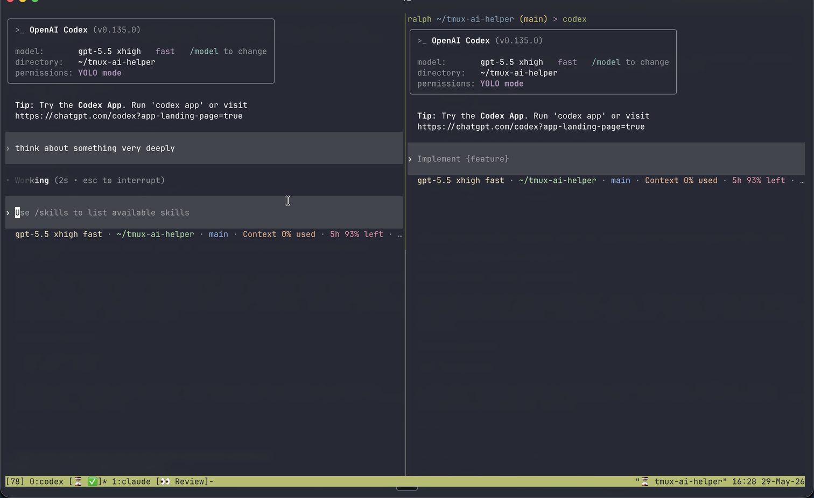
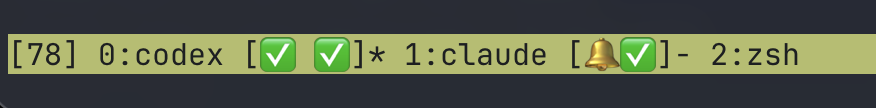
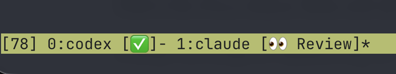
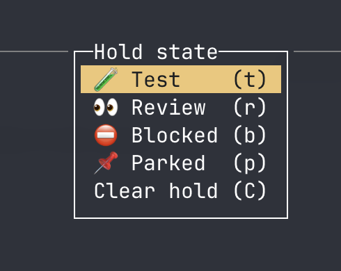
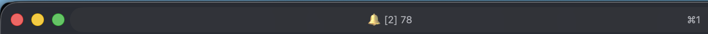

# tmux-ai-helper

`tmux-ai-helper` turns terminal progress signals from coding agents into tmux UI state.

It does not wrap Claude Code, Codex, or any other agent. tmux attaches it to panes with `pipe-pane`; the helper reads terminal output, detects progress/title sequences, stores normalized state in tmux user options, and lets your tmux status line show what each agent is doing.

Use it when you run multiple coding agents in tmux and want the terminal to tell you:

- which panes are still working
- which hidden pane finished or failed
- which tmux window needs your attention
- how many unread agent completions are waiting in the session
- which work windows are intentionally parked, blocked, in review, or waiting on tests

## Features

Verified from the source code:

- Listens through tmux `pipe-pane`, so your existing agent commands still run normally.
- Attaches idempotently with `pipe-pane -o`; panes that already have a pipe are left alone.
- Ignores visible terminal text and reacts only to OSC/title control sequences.
- Handles OSC sequences terminated by BEL or ST, including sequences split across reads.
- Parses `OSC 9;4` progress reports.
- Recognizes active progress, optional `0..100` percent values, clear/done/inactive/completed, error/failed, and pause/paused states.
- Parses `OSC 0` and `OSC 2` terminal title updates.
- Detects native Codex braille spinner prefixes.
- Detects Claude Code title state prefixes for active work and done state.
- Detects several common spinner prefixes used by other terminal tools.
- Gives `OSC 9;4` progress precedence over native title spinner updates once OSC progress has appeared in a pane.
- Chooses a stable base title from stored helper state, parsed title state, the tmux window name, or the `shell` fallback.
- Converts agent state into helper-managed pane display titles:

  ```text
  shell
  ⏳ codex
  ⏳ 42% Claude Code
  ✅ codex
  ❌ codex
  ⏸ codex
  🔔 ✅ codex
  ```

- Keeps helper display titles separate from tmux's app-owned `#{pane_title}` by writing `@tmux_ai_helper_v1_display_title`.
- Strips old helper prefixes before regenerating titles, preventing stacked `🔔`, `✅`, or `⏳` markers after restarts.
- Persists pane activity, attention, base title, percent, source, and display title in tmux pane options.
- Builds compact tmux window summaries in pane order, such as `⏳`, `⏳ ⏳ 🔔✅`, or `⏳ 🔔❌ ⏸`.
- Omits idle panes from the window summary unless they need attention.
- Tracks hidden completions separately from completion state: `✅` means finished, `🔔` means finished while hidden.
- Creates attention only when a pane transitions from active/paused to done/error while not visible.
- Lets you manually mark a pane as needing attention again.
- Clears attention when a pane becomes active again or when configured tmux hooks call `clear-pane`, `clear-window`, or `clear-session`.
- Uses tmux focus reporting when available, so a selected tmux window in an unfocused terminal tab can still count as hidden.
- Falls back to active-window visibility when focus reporting is unavailable.
- Treats non-active panes in a zoomed tmux window as hidden.
- Maintains a session-level unread count in `@tmux_ai_helper_v1_attention_count`.
- Supports terminal bell notifications when hidden work completes.
- Supports command notifications with pane, window, session, activity, and title environment variables.
- Supports disabling notification backends with `none` or `off`.
- Provides manual window holds for work waiting on external action.
- Ships default hold states: `test`, `review`, `blocked`, and `parked`.
- Lets you configure custom hold states and labels with tmux options.
- Accepts the legacy `pr` hold key as an alias for `review`.
- Shows a tmux hold menu with `hold-menu`.
- Gives manual holds precedence over AI progress summaries in the window list.
- Suppresses attention and unread counts for held windows.
- Stores hold key, label, and timestamp in tmux window options.
- Marks an active or paused pane as done when its listener reaches EOF.
- Provides explicit CLI commands for attach, attach-all, listen, mark-pane, clear, hold, hold-clear, and hold-menu.
- Uses no third-party Rust crates.

## How It Feels

Without this helper, a tmux window running several agents usually looks idle unless you open every pane. With it, your window list can keep your own names while appending live state:

```text
1:api [⏳]
2:auth [⏳ 🔔✅]
3:billing [🔔❌]
4:search [🧪 Test]
```

The terminal title can also show a durable unread count:

```text
tmux-ai-helper
[2] tmux-ai-helper
```

That is the UX upgrade: the status line becomes a lightweight operations board for agent work, without changing how you launch or interact with the agents.

## Screenshots

These examples are cropped from a tmux/Ghostty session. Exact colors and glyphs depend on your tmux theme, terminal, and font.

Split panes keep the agent UI untouched while the tmux status line adds compact state:



Hidden completions and active panes collapse into window-list badges:



Manual holds override the AI summary when a window is waiting on something external:



The hold menu gives you a quick way to mark a window as testing, review, blocked, or parked:



The terminal title can show the durable unread count separately from tmux's window-list badges:



## Requirements

- tmux 3.x recommended.
- Rust stable toolchain to build from source.
- A terminal with Unicode symbol support.
- `focus-events on` in tmux for the best hidden/visible detection.

The terminal bell backend is best-effort. Depending on terminal settings, a bell may flash the tab, play a sound, bounce a dock icon, mark the title, or do nothing.

## Install

### Linux Packages

On Ubuntu or Debian:

```sh
sudo apt update
sudo apt install -y git build-essential tmux curl
```

On Amazon Linux 2023, Fedora, or RHEL-like systems:

```sh
sudo dnf install -y git gcc make tmux curl
```

On Amazon Linux 2:

```sh
sudo yum install -y git gcc make tmux curl
```

### Rust

Install Rust if it is not already installed:

```sh
curl --proto '=https' --tlsv1.2 -sSf https://sh.rustup.rs | sh
. "$HOME/.cargo/env"
```

### Build And Install

```sh
git clone https://github.com/ralphkrauss/tmux-ai-helper.git
cd tmux-ai-helper
cargo build --release
mkdir -p "$HOME/.local/bin"
install -m 0755 target/release/tmux-ai-helper "$HOME/.local/bin/tmux-ai-helper"
```

On macOS, the same build/install commands work once tmux and Rust are installed.

## tmux Setup

Add this to `~/.tmux.conf`:

```tmux
set -g focus-events on
set -g @tmux_ai_helper_path "$HOME/.local/bin/tmux-ai-helper"

# tmux-ai-helper writes its normalized display title to a pane option, so
# #{pane_title} can remain app-owned on tmux builds without allow-set-title.

# Let tmux, not applications, own the outer terminal title. The terminal owns
# native bell behavior; tmux keeps only the durable unread count by default.
set -g set-titles on
set -g @tmux_ai_helper_title_mode "count"
set -g set-titles-string '#{?#{>:#{@tmux_ai_helper_v1_attention_count},0},#{?#{==:#{@tmux_ai_helper_title_mode},off},,#{?#{==:#{@tmux_ai_helper_title_mode},emoji},🔔#{@tmux_ai_helper_v1_attention_count} ,[#{@tmux_ai_helper_v1_attention_count}] }},}#S'

# Manual hold states for windows that are waiting on something external.
set -g @tmux_ai_helper_hold_state_order "test review blocked parked"
set -g @tmux_ai_helper_hold_state_test "🧪 Test"
set -g @tmux_ai_helper_hold_state_review "👀 Review"
set -g @tmux_ai_helper_hold_state_blocked "⛔ Blocked"
set -g @tmux_ai_helper_hold_state_parked "📌 Parked"
bind-key H run-shell -b '"#{@tmux_ai_helper_path}" hold-menu "#{pane_id}"'
bind-key U run-shell -b '"#{@tmux_ai_helper_path}" mark-pane "#{pane_id}"'

# Ring the attached terminal when hidden AI work completes. Add "command" here
# to run @tmux_ai_helper_notify_command as well.
set -g @tmux_ai_helper_notify_backends "bell"
set -g @tmux_ai_helper_notify_command ""

# Show helper-managed display titles in tmux's window list. The window-level marker
# covers split-pane cases where a hidden pane in the window needs attention.
setw -g window-status-format '#I:#W#{?#{@tmux_ai_helper_v1_hold_label}, [#{@tmux_ai_helper_v1_hold_label}],#{?#{@tmux_ai_helper_v1_window_summary}, [#{@tmux_ai_helper_v1_window_summary}],}}#{?window_flags,#{window_flags}, }'
setw -g window-status-current-format '#I:#W#{?#{@tmux_ai_helper_v1_hold_label}, [#{@tmux_ai_helper_v1_hold_label}],#{?#{@tmux_ai_helper_v1_window_summary}, [#{@tmux_ai_helper_v1_window_summary}],}}#{?window_flags,#{window_flags}, }'
setw -g pane-border-format '#{?pane_active,#[reverse],}#{pane_index}#[default] "#{?#{@tmux_ai_helper_v1_display_title},#{@tmux_ai_helper_v1_display_title},#{pane_title}}"'
set -g status-right '#{?window_bigger,[#{window_offset_x}#,#{window_offset_y}] ,}"#{=21:#{?#{@tmux_ai_helper_v1_display_title},#{@tmux_ai_helper_v1_display_title},#{pane_title}}}" %H:%M %d-%b-%y'

# Attach the helper automatically to new panes.
set-hook -g after-new-session 'run-shell -b "helper=\"#{@tmux_ai_helper_path}\"; test ! -x \"\$helper\" || \"\$helper\" attach-all"'
set-hook -g after-new-window 'run-shell -b "helper=\"#{@tmux_ai_helper_path}\"; pane=\"#{pane_id}\"; test -z \"\$pane\" || test ! -x \"\$helper\" || \"\$helper\" attach \"\$pane\""'
set-hook -g after-split-window 'run-shell -b "helper=\"#{@tmux_ai_helper_path}\"; pane=\"#{pane_id}\"; test -z \"\$pane\" || test ! -x \"\$helper\" || \"\$helper\" attach \"\$pane\""'

# Clear attention when you visit a marked window/pane.
set-hook -g after-select-window 'run-shell -b "helper=\"#{@tmux_ai_helper_path}\"; test ! -x \"\$helper\" || \"\$helper\" clear-window \"#{window_id}\""'
set-hook -g session-window-changed 'run-shell -b "helper=\"#{@tmux_ai_helper_path}\"; test ! -x \"\$helper\" || \"\$helper\" clear-window \"#{window_id}\""'
set-hook -g after-select-pane 'run-shell -b "helper=\"#{@tmux_ai_helper_path}\"; test ! -x \"\$helper\" || \"\$helper\" clear-pane \"#{pane_id}\""'
set-hook -g client-attached 'run-shell -b "helper=\"#{@tmux_ai_helper_path}\"; test ! -x \"\$helper\" || \"\$helper\" clear-window \"#{window_id}\""'
set-hook -g client-focus-in 'run-shell -b "helper=\"#{@tmux_ai_helper_path}\"; test ! -x \"\$helper\" || \"\$helper\" clear-window \"#{window_id}\""'

# Attach the helper to panes that already exist when the config is sourced.
run-shell -b 'helper="#{@tmux_ai_helper_path}"; test ! -x "$helper" || "$helper" attach-all'
```

Apply the config:

```sh
tmux source-file ~/.tmux.conf
```

If you enabled `focus-events` for an already attached tmux client, detach and attach once after sourcing. tmux requests focus reporting when the client attaches.

## Configuration

### Display State

Pane titles are generated from activity, attention, percent, and base title:

```text
idle:            <title>
active:          ⏳ <title>
active percent:  ⏳ 42% <title>
done:            ✅ <title>
error:           ❌ <title>
paused:          ⏸ <title>
attention:       🔔 ✅ <title> or 🔔 ❌ <title>
```

Window summaries are generated from the panes in that window:

```text
[⏳]
[⏳ ⏳ 🔔✅]
[⏳ 🔔❌ ⏸]
[🔔 ✅]
```

### Manual Attention

If you visited a finished pane and want to mark it unread again, run:

```sh
tmux-ai-helper mark-pane <pane-id>
```

The recommended setup binds this to `prefix U` for the current pane.

### Terminal Title Modes

The recommended tmux config supports three title modes:

```tmux
set -g @tmux_ai_helper_title_mode "count"
```

- `count`: show `[2] session-name` when there are unread completions.
- `emoji`: show `🔔2 session-name`.
- `off`: show only `session-name`.

Native terminal bells are transient. The tmux unread count is durable until cleared.

### Manual Holds

Use holds for work that is intentionally waiting outside the agent loop, such as tests, review, blocked work, or parked work:

```text
3:auth-flow [🧪 Test]
4:billing [👀 Review]
5:deploy [⛔ Blocked]
6:search [📌 Parked]
```

Held windows show the hold label instead of the AI progress summary. Held windows also suppress AI attention and do not increment the session unread count.

Default hold states:

```tmux
set -g @tmux_ai_helper_hold_state_order "test review blocked parked"
set -g @tmux_ai_helper_hold_state_test "🧪 Test"
set -g @tmux_ai_helper_hold_state_review "👀 Review"
set -g @tmux_ai_helper_hold_state_blocked "⛔ Blocked"
set -g @tmux_ai_helper_hold_state_parked "📌 Parked"
```

Set or clear a hold manually:

```sh
tmux-ai-helper hold test
tmux-ai-helper hold review
tmux-ai-helper hold blocked
tmux-ai-helper hold parked
tmux-ai-helper hold-clear
```

The older `pr` key is accepted as an alias for `review`.

The recommended key binding opens a tmux menu for the current window:

```tmux
bind-key H run-shell -b '"#{@tmux_ai_helper_path}" hold-menu "#{pane_id}"'
```

Add custom states by adding a key to `@tmux_ai_helper_hold_state_order` and defining a label:

```tmux
set -g @tmux_ai_helper_hold_state_order "test review blocked parked design"
set -g @tmux_ai_helper_hold_state_design "🎨 Design"
```

State keys may contain letters, numbers, `_`, and `-`. Labels may contain spaces and emoji.

### Notifications

The default notification backend is `bell`:

```tmux
set -g @tmux_ai_helper_notify_backends "bell"
```

The bell backend writes BEL to every attached client tty for the session when hidden work completes.

You can also run a command:

```tmux
set -g @tmux_ai_helper_notify_backends "bell command"
set -g @tmux_ai_helper_notify_command 'notify-send "AI finished" "$TMUX_AI_HELPER_TITLE"'
```

The command receives these environment variables:

- `TMUX_AI_HELPER_PANE`
- `TMUX_AI_HELPER_WINDOW`
- `TMUX_AI_HELPER_SESSION`
- `TMUX_AI_HELPER_ACTIVITY`
- `TMUX_AI_HELPER_TITLE`

Use `none` or `off` to disable notification work:

```tmux
set -g @tmux_ai_helper_notify_backends "off"
```

Notification backend names can be separated by spaces or commas.

## Commands

```text
tmux-ai-helper attach <pane-id>
tmux-ai-helper attach-all [session-id]
tmux-ai-helper doctor [session-id]
tmux-ai-helper listen <pane-id>
tmux-ai-helper mark-pane <pane-id>
tmux-ai-helper clear-pane <pane-id>
tmux-ai-helper clear-window <window-id>
tmux-ai-helper clear-session <session-id>
tmux-ai-helper hold <state-key> [window-id]
tmux-ai-helper hold-clear [window-id]
tmux-ai-helper hold-menu [pane-id|window-id]
```

Most users call `attach`, `attach-all`, `mark-pane`, `clear-*`, `hold`, `hold-clear`, or `hold-menu` through tmux hooks and key bindings. `listen` is the internal command run by `pipe-pane`.

Use `doctor` when an existing pane looks stale after sourcing the config:

```sh
tmux-ai-helper doctor
tmux-ai-helper attach-all
```

`doctor` exits successfully when every pane has a `pipe-pane` listener. If any pane still reports `#{pane_pipe}=0`, it lists those pane ids so you can recover with `attach-all` or `attach <pane-id>`.

## tmux State Options

Pane options:

- `@tmux_ai_helper_v1_activity`
- `@tmux_ai_helper_v1_attention`
- `@tmux_ai_helper_v1_base_title`
- `@tmux_ai_helper_v1_display_title`
- `@tmux_ai_helper_v1_percent`
- `@tmux_ai_helper_v1_source`

Window options:

- `@tmux_ai_helper_v1_attention`
- `@tmux_ai_helper_v1_window_summary`
- `@tmux_ai_helper_v1_hold_key`
- `@tmux_ai_helper_v1_hold_label`
- `@tmux_ai_helper_v1_hold_since`

Session option:

- `@tmux_ai_helper_v1_attention_count`

Helper-read configuration options:

- `@tmux_ai_helper_hold_state_order`
- `@tmux_ai_helper_hold_state_<key>`
- `@tmux_ai_helper_notify_backends`
- `@tmux_ai_helper_notify_command`

Recommended tmux.conf convenience options:

- `@tmux_ai_helper_path`: used by the sample hooks and key binding to find the installed binary.
- `@tmux_ai_helper_title_mode`: used by the sample `set-titles-string` to choose `count`, `emoji`, or `off`.

## SSH Notes

For SSH, install and configure the helper inside the remote tmux server:

```sh
tmux source-file ~/.tmux.conf
tmux detach-client
```

Then reconnect or reattach:

```sh
ssh ec2-user@your-host
tmux attach
```

Name the remote tmux session after the work context you want in your local terminal tab:

```sh
tmux new -s tmux-ai-helper
# or, from inside an existing session:
tmux rename-session tmux-ai-helper
```

Over SSH:

- the remote tmux window list keeps your manual window name and appends helper state
- the remote tmux outer title can show `[N]` in front of the remote session name
- BEL travels through SSH to your local terminal as a best-effort notification

For the cleanest Ghostty behavior, connect directly from Ghostty into the remote tmux session. If you run remote tmux inside a local tmux session, the local tmux server usually owns the outer terminal title, so the remote session name and count may not reach the Ghostty tab.

Focus detection over SSH depends on the local terminal, SSH connection, and remote tmux terminal features. If focus reporting is unavailable, the helper falls back to tmux active-window visibility, so the durable tmux indicators still work.

## Terminal Tab Names

Do not use terminal-specific tab title overrides if you want tmux-ai-helper prefixes to remain visible. In Ghostty, "Change Tab Title..." overrides terminal title updates, so tmux cannot prepend `[1]` or `[2]` to that label.

Instead, rename the tmux session:

```sh
tmux rename-session tmux-ai-helper
```

The outer terminal title will then use:

```text
tmux-ai-helper
[2] tmux-ai-helper
```

## Compatibility

The helper is designed for tmux 3.x. It does not require `allow-set-title`, so the same configuration works on tmux builds that have that option and on builds, such as tmux 3.4, that do not.

Applications may still update tmux's built-in `#{pane_title}` with OSC title sequences. tmux-ai-helper stores its normalized pane display in `@tmux_ai_helper_v1_display_title` and its ordered window state suffix in `@tmux_ai_helper_v1_window_summary`.

tmux supports only one `pipe-pane` command per pane. If you use `pipe-pane` for logging, it will conflict with this helper in that pane.

## Maintenance And Troubleshooting

After rebuilding, reinstall the binary and restart existing pane listeners:

```sh
cargo build --release
install -m 0755 target/release/tmux-ai-helper ~/.local/bin/tmux-ai-helper
tmux source-file ~/.tmux.conf
```

Confirm the helper is attached to panes:

```sh
tmux list-panes -a -F '#{session_name}:#{window_index}.#{pane_index} pipe=#{pane_pipe} window=#{@tmux_ai_helper_v1_window_summary} title=#{@tmux_ai_helper_v1_display_title} raw=#{pane_title}'
```

`pipe=1` means a pane has a `pipe-pane` listener attached.

If any pane reports `pipe=0`, run the catch-up attach command:

```sh
tmux-ai-helper attach-all
```

`attach-all` retries startup attachment briefly and reports pane-specific failures with tmux error output when a pane cannot be attached.

Inspect hold state across all windows:

```sh
tmux list-windows -a -F '#{session_name}:#{window_index}:#{window_name} hold=#{@tmux_ai_helper_v1_hold_label} ai=#{@tmux_ai_helper_v1_window_summary}'
```

If the hold menu does not open, check the installed helper path and key binding:

```sh
tmux show-options -gqv @tmux_ai_helper_path
tmux list-keys H
```

Operational notes:

- The helper uses one idle process per attached pane.
- It reads with blocking I/O and calls tmux only when parsed state changes or attention is created/cleared.
- Manual holds survive detach/reattach for as long as the tmux server is running, but they are not written to disk.
- If the install path changes, update `@tmux_ai_helper_path` in `~/.tmux.conf`.
